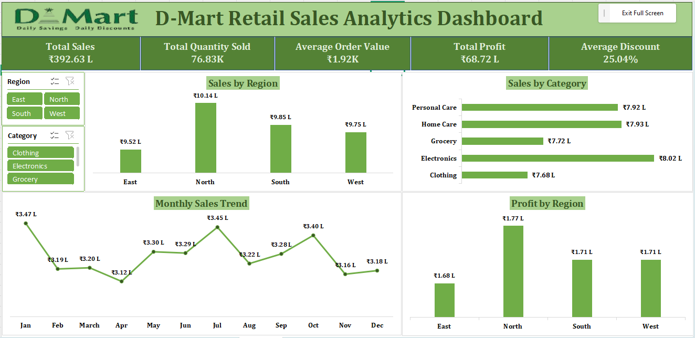

# 📊 D-Mart Sales Dashboard (Excel)

## 📌 Project Overview

This project presents an interactive Sales Dashboard built in Microsoft Excel using the D-Mart Sales dataset. The dashboard provides key business insights through KPIs, Pivot Tables, Pivot Charts, and Slicers to support data-driven decision-making.

---

## 🎯 Objective

To analyze D-Mart sales data and create an interactive dashboard that helps understand sales performance, customer behavior, and business trends.

---

## 🛠 Tools Used

- Microsoft Excel
- Pivot Tables
- Pivot Charts
- Slicers
- Conditional Formatting
- Data Cleaning

---

## 📈 Dashboard Features

- ✅ Total Sales KPI
- ✅ Total Profit KPI
- ✅ Total Orders
- ✅ Sales Trend Analysis
- ✅ Category-wise Sales
- ✅ Investment Type Analysis *(or replace with your actual chart)*
- ✅ Interactive Slicers

---

## 📷 Dashboard Preview

> Upload **Dashboard.png** and replace the line below.

---

## 📊 Key Insights

- Identified the highest-performing categories.
- Compared sales across different segments.
- Analyzed sales trends using interactive charts.
- Built an easy-to-use dashboard for business reporting.

---

## 💼 Skills Demonstrated

- Data Cleaning
- Data Analysis
- Data Visualization
- Dashboard Development
- Pivot Tables
- Business Intelligence
- Microsoft Excel

---

## 📂 Repository Files

| File | Description |
|------|-------------|
| Dataset_Dmart.xlsx | Original dataset |
| Dashboard.png | Dashboard screenshot |
| Dashboard.pdf | Dashboard exported as PDF |
| README.md | Project documentation |

---

## 👩‍💻 Author

**Srushti Khare**

- LinkedIn: https://www.linkedin.com/in/srushtikhare/
- GitHub: https://github.com/SrushtiKhare
